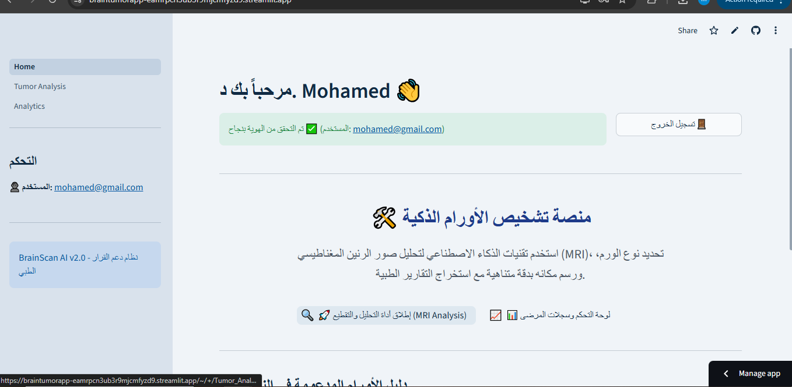
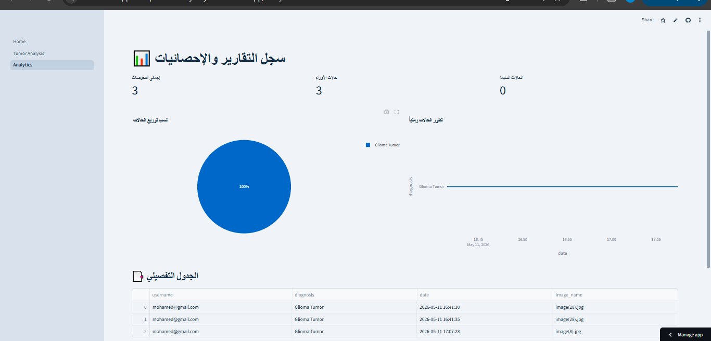
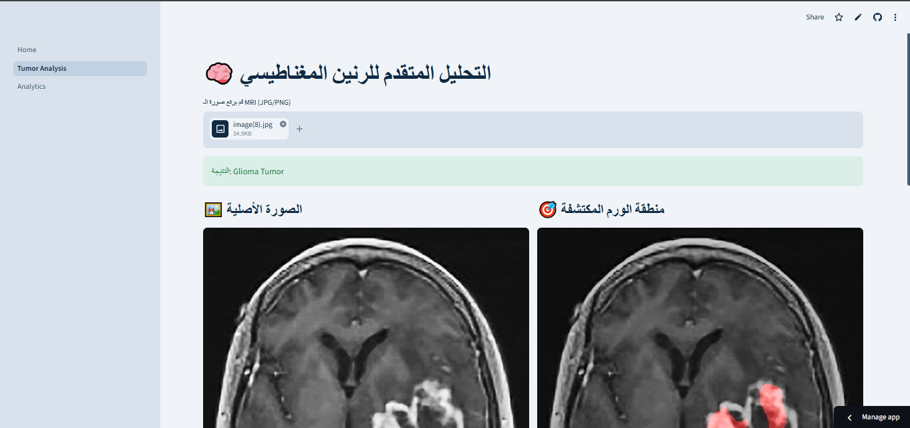

# 🧠 Brain Tumor AI — Classification & Segmentation System


> 🧬 AI-powered medical system for brain tumor detection using MRI images with classification, segmentation, and radiomics analysis.

---

## 🌐 Live Demo
🚀 Try the app here:  
👉 [Streamlit App](https://braintumorapp-eamrpcn3ub3r9mjcmfyzd9.streamlit.app/)

---

## 📸 Screenshots

### 🏠 Home Page


### 🔬 Tumor Analysis


### 📊 Analytics Dashboard


---

## 🚀 Features

- 🧠 Brain tumor classification (Glioma, Meningioma, Pituitary, No Tumor)
- 🎯 Tumor segmentation using deep learning (U-Net)
- 🧬 Radiomics feature extraction (shape + texture analysis)
- 📊 Interactive analytics dashboard
- 🔐 Secure login system for doctors
- ⚡ Real-time MRI inference

---

## 🛠️ Tech Stack

- 🐍 Python
- 🤖 TensorFlow / Keras :contentReference[oaicite:0]{index=0}
- 🌐 Streamlit :contentReference[oaicite:1]{index=1}
- 👁️ OpenCV :contentReference[oaicite:2]{index=2}
- 📊 Pandas / NumPy
- 📉 Scikit-learn
- 🧬 PyRadiomics

---

## 📂 Project Structure

```bash
brain-tumor-ai/
│
├── Home.py                 # Login & main dashboard
├── requirements.txt
├── brain_tumor1.h5        # Classification model on drive 
├── segment_model.h5       # Segmentation model  on drive
│
├── pages/
│   ├── 1_Tumor_Analysis.py
│   ├── 2_Analytics.py
│
├── assets/
│   ├── home.png
│   ├── analysis.png
│   └── dashboard.png
```

---

## ⚙️ Installation & Setup

### 1️⃣ Clone repository
```bash
git clone https://github.com/MohamedFolyNabyh
cd brain_tumor_app
```

---

### 2️⃣ Install dependencies
```bash
pip install -r requirements.txt
```

---

### 3️⃣ Install gdown
```bash
pip install gdown
```

---

### 4️⃣ Download AI Models
```bash
gdown --id YOUR_CLASSIFICATION_MODEL_ID -O brain_tumor1.h5
gdown --id YOUR_SEGMENTATION_MODEL_ID -O segment_model.h5
```

---

## 🧬 System Pipeline

### 1. Input
MRI image upload

### 2. Preprocessing
Normalization + resizing using OpenCV

### 3. Classification
CNN model detects tumor type

### 4. Segmentation
U-Net generates tumor mask

### 5. Radiomics
Feature extraction (shape + texture)

### 6. Reporting
Final medical dashboard output

---

## 📊 Output Example

- Tumor Type: Glioma  
- Confidence: 97.8%  
- Segmentation: Highlighted mask  
- Radiomics: Extracted features  

---

## 🔐 Security

- Login system with hashed passwords (SHA256)
- Session-based authentication
- Protected analytics dashboard

---

## 📌 Future Improvements

- DICOM medical file support
- Grad-CAM explainability
- Cloud deployment API
- Multi-class tumor grading (WHO levels)

---

## 👨‍💻 Author

- **Mohamed Foly**
- AI & Medical Imaging Developer


---

## ⭐ Support

If you like this project:
- ⭐ Star the repo
- 🍴 Fork it
- 📢 Share it

---
